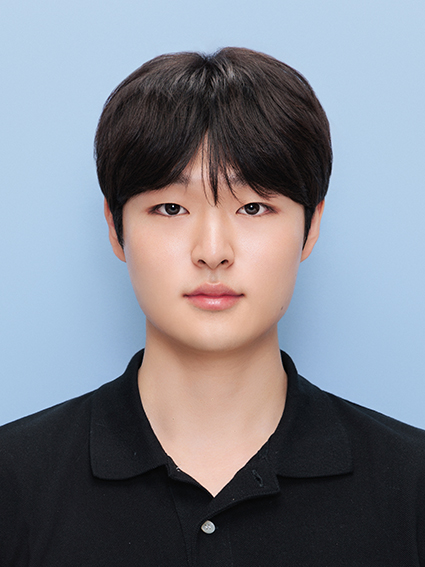

::: {.grid}

::: {.g-col-12 .g-col-md-4}

{width=80%}

:::

::: {.g-col-12 .g-col-md-8}

### Kanghyuk Seo  

Researcher at Wave Shine Tech

**Email:** kanghyuk.2k@gmail.com  
**Location:** Seoul, Republic of Korea  

[Google Scholar](https://scholar.google.com/citations?hl=ko&user=1zQ9ud8AAAAJ)
&nbsp;&nbsp;·&nbsp;&nbsp;
[LinkedIn](https://www.linkedin.com/in/kanghyuk-seo-357286325/)
&nbsp;&nbsp;·&nbsp;&nbsp;
[ResearchGate](https://www.researchgate.net/profile/Kanghyuk-Seo)

:::

:::

## Short Bio
I was born in Seoul, South Korea, in December 2000.

I received the B.S. degree in Electronic Engineering from Soongsil University in 2026.  

I worked as an undergraduate researcher in the Microwave & Radar Institute of Technology (MERIT) Laboratory at Soongsil University. I am currently working as a researcher at Wave Shine Tech.  

My research interests include wireless sensing, wireless communications, reconfigurable intelligent surface (RIS)-aided wireless systems, and integrated sensing and communication (ISAC).

## Affiliations

### [Wave Shine Tech](https://waveshine-tech.com/)
  
**Researcher · Software Development Team (2026.10 ~ )**  
Wave Shine Tech is a South Korean wireless communications startup developing RIS-based infrastructure to improve wireless coverage in challenging propagation environments.  

My work focuses on radio propagation modeling for RIS-aided wireless systems.

### [Microwave & Radar Institute of Technology (MERIT) Laboratory](https://sites.google.com/view/meritssu)

**Undergraduate Researcher (2023.09 ~ )**  
MERIT-Lab, based at Soongsil University in Seoul, South Korea, conducts research on advanced and next-generation radar systems.  

My research focuses on radar systems and signal processing. 

## Honors & Awards

- **National Science & Technology Scholarship (full-tuition for all four years of the B.S. program)**  
The Government of the Republic of Korea, 2019.

- **Departmental Honors Award (School of Electronic Engieering)**  
Soongsil University, 2026. 

- **LUMIR Best Paper Award**  
KIEES Summer Conference, 2024

- **Best Undergraduate Paper Award**  
KIEES Fall Conference, 2023

## Publications

1. **K. Seo** and C. K. Kim, “Doppler Bandwidth Estimation for Short-Range SAR Considering Signal Attenuation,”  
   *IEEE Access*, 2025.

2. **K. Seo**, Y. Kwon, and C. K. Kim, “An Enhanced Phase Gradient Autofocus Algorithm for SAR: A Fractional Fourier Transform Approach,”  
   *Remote Sensing*, 2025.

3. Y. Kwon, **K. Seo**, and C. K. Kim, “Enhancing Calibration Precision in MIMO Radar with Initial Parameter Optimization,”  
   *Remote Sensing*, 2025.  

4. *(Under Review)*, **K. Seo**, S. Kyeong, and C. K. Kim, "WD-guided Effective Doppler Chirp-Rate Redesign for Parabolic RDA in Short-Range Wide-Beam SAR,"  
   *IEEE geoscience and remote sensing letters*, 2026.

## Patents

1. Y. H. Kwon, **K. Seo** and C. K. Kim, “Electronic Device for Performing Beamforming based on Fractional Fourier Transform Applicable to a Single Snapshot Structure, and Method of Operation Thereof,”  
   (KR Patent Application)

## Conference Presentations

- **ISAP 2024** — Oral Presentation
- **KIEES 2024 Summer Conference** — Oral Presentation
- **KIEES 2023 Fall Conference** — Poster Presentation

## Academic & Community Service

### Journal Reviewer

Peer reviewer for international peer-reviewed journals, including:

- *IEEE Transactions on Aerospace and Electronic Systems*
- *IEEE Journal of Selected Topics in Applied Earth Observations and Remote Sensing*
- *Scientific Reports*
- *Signal, Image and Video Processing*
