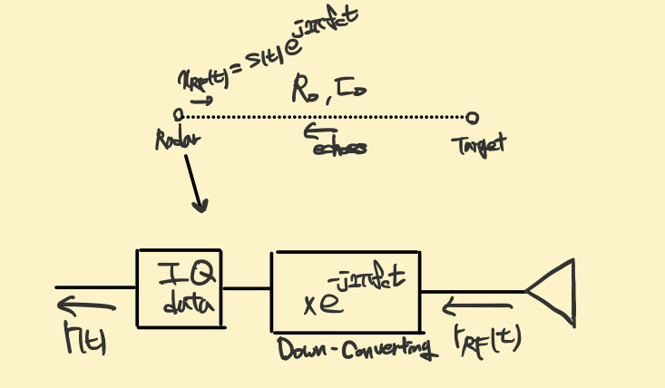
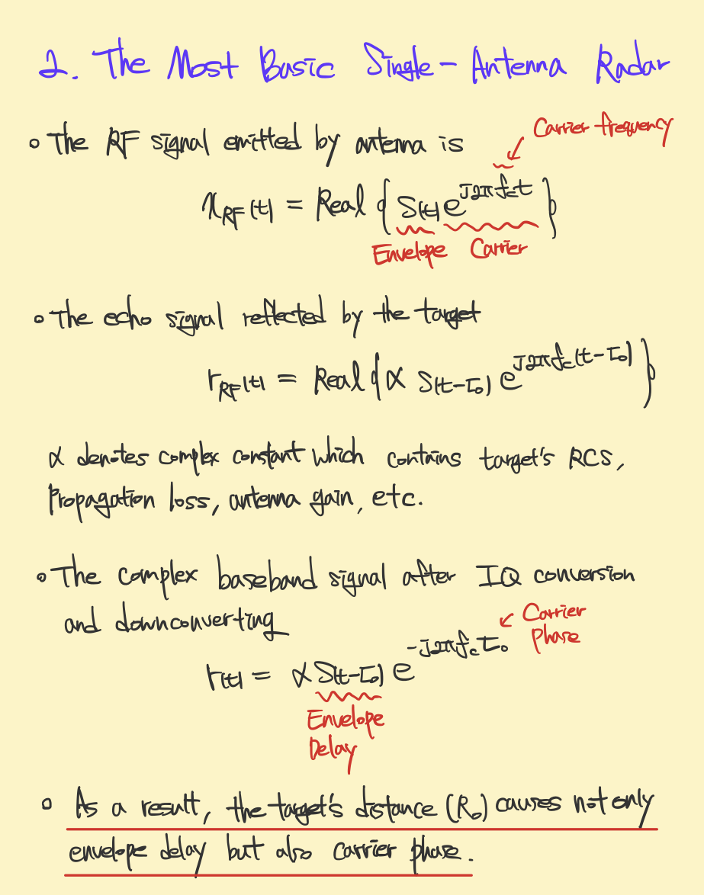
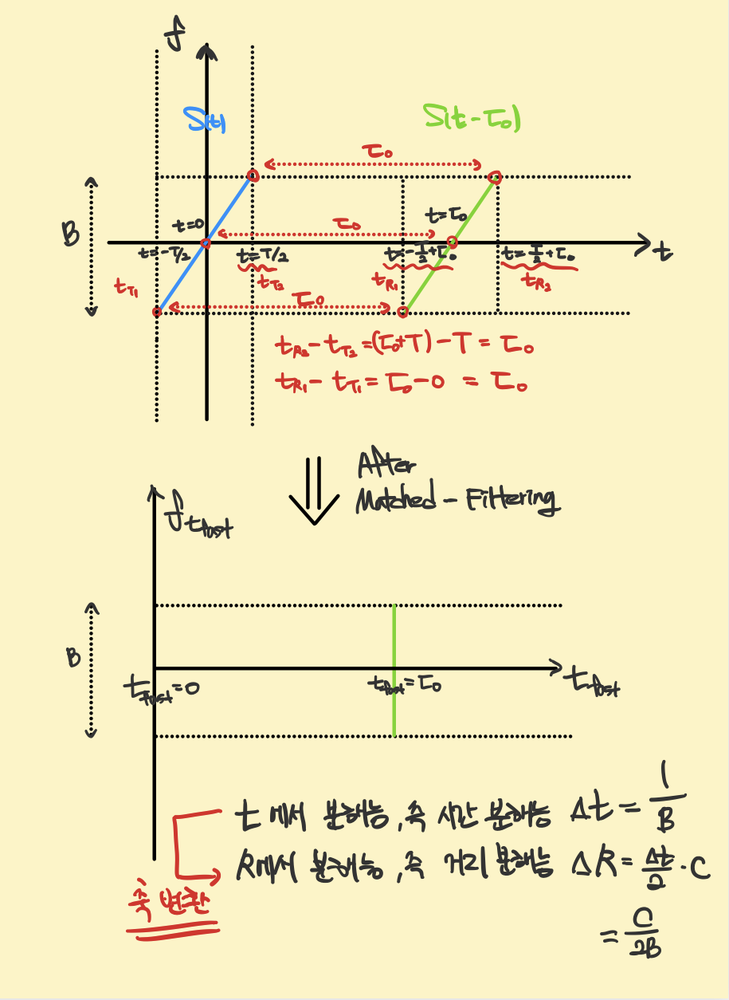
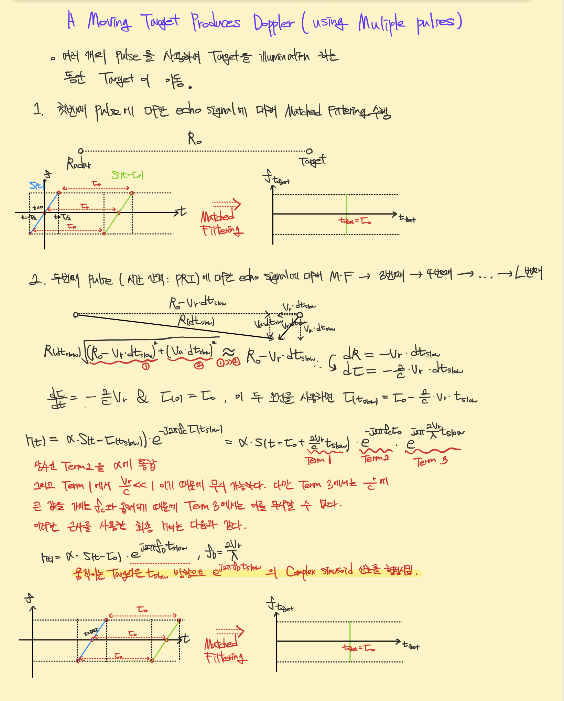
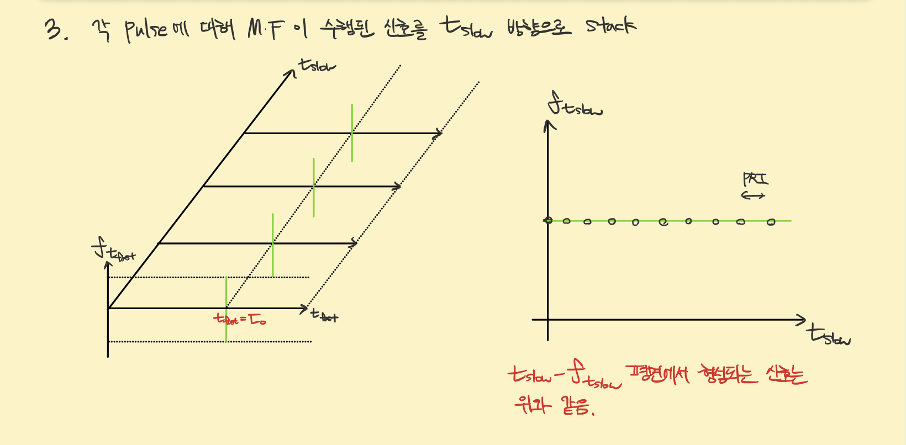
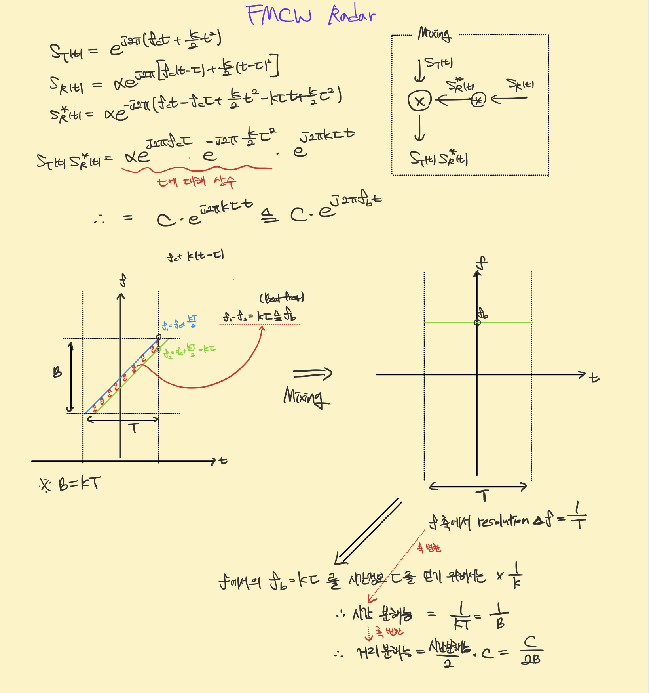
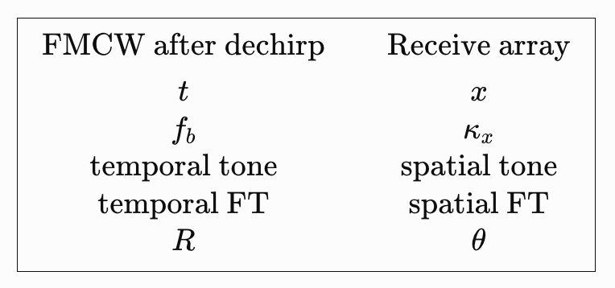

## Introduction

Radar signal processing is often introduced as a collection of individual techniques, including pulse compression,
Doppler processing, FMCW dechirping, beamforming, phased arrays, MIMO radar, and SAR. Although each techque has its own
physical motivation and mathematical formulation, studying them independently can make it difficult to recognize the common 
signal-processing principles that connect them. This note is an attempt to organize these techniques according to my own understanding of radar signal processing, developed
through my studies and research experience. Rather than presenting a comprehensive text treatment or a strict historical account of 
radar development, I aim to build a continuous interpretation of how radar systems encode physical information into signal structures and 
how those structures are subsequently transformed, separated, concentrated, or synthesized across time, frequency, and space.  

The central question throughout this note is: 

**How is the energy of a radar signal formed in a particular domain, and how does signal processing reshape or interpret that energy to extract physical information?**

For example, an LFM signal forms a chirped trajectory in the time-frequency plane. In pulse compression, matched filtering compensates the corresponding phase structure 
so that the distributed signal energy becomes concentrated at a specific time or spatial position. In FMCW radar, by contrast, dechirping converts propagation delay into a beat 
frequency, producing a constant-frequency structure whose location can be identified through Fourier analysis. Doppler processing similarly interprets a slow-time sinusoid in terms of 
radial velocity. The same perspective can be extended from temporal processing to spatial processing. A plane wave arriving at an antenna array produces a spatial phase progression across 
the aperture. This progression can be interpreted as a spatial frequency, allowing Fourier-domain intuition developed for temporal signals to be extended naturally to array processing, 
beamforming, phased arrays, and eventually MIMO radar. 

Accordingly, the discussion will repeatedly follow the conceptual sequence 

**Physical parameter → signal structure → energy geometry → processing operation → energy concentration or separation → physical interpretation**

The goal is to understand why each operation is appropriate for the signal structure produced by a particular radar configuration, and how the resulting representation reveals the desired physical quantity. 
From this viewpoint, the evolution or radar can be interpreted not only as a progression of hardware architectures or individual algorithms, but also an expansion of the domains in which radar can encode and manipulate information:

**time → time and frequency → slow time → space → synthetic and virtual spatial dimensions.**

This note therefore develops a personal, signal-centric view of the evoltion of radar techniques, with particualr emphasis on the geometry of signal energy and the relationship between temporal, spectral, and spatial processing. 

## A Unified View of Radar 

Radar can be understood as a system that converts physical properties of a scene into structured distributions of signal energy, processes those structures in an appropriate domain, 
and finally interprets the resulting energy concentration in terms of physical parameters such as range, velocity, and direction.

Each technique is interpreted through the following sequence: 

**Physical parameter → signal structure → energy geometry → processing operation → energy concentration or separation → physical interpretation**

## The Fundamental Radar Measurement

{#fig-receiver width="50%" fig-align="center"}  

{#fig-receiver width="50%" fig-align="center"}  

Consider first a monostatic radar transmitting a complex-basedband waveform $s(t)$ at carrier frequency $f_c$. 
The transmitted RF waveform can be written as 
$$
x_{\mathrm{RF}}(t)
=
\Re
\left\{
s(t)e^{j2\pi f_c t}
\right\}.
$$
For a stationary point target at range $R$, the round-trip propagation delay is 
$$
\tau=\frac{2R}{c}.
$$
Ignoring secondary effects, the received basedband signal can be represented as 
$$
r(t)=\alpha s(t-\tau) e^{-j2\pi f_c\tau},
$$
where $\alpha$ contains propagation loss, target scattering, and constant phase terms. 
The first important interpretation is that range appears in two related ways: **R → $\tau$ → envelope displacement**
and **R →$e^{-j4\pi R / \lambda}$ → carrier phase** with $\lambda=c/f_c$. 
Thus, even the simplest radar measurement already contains both temporal and phase information.  
For a moving target, $R=R(t)$, and therefore $\tau(t)=\frac{2R(t)}{c}$. The more fundamental received-signal model is consequently  
$$
r(t)=\alpha s(t-\tau(t))e^{j2\pi f_c \tau(t)}
$$
Both the envelope delay and the carrier phase are affected by target motion. The familiar Doppler-only representation arises only after appropriate approximatinos. 
This starting point is important because every later radar technique can be viewed as exploiting a particular structure generated by $R(t)$, the waveform, the observation coordinate, or the antenna geometry.

## Basic Pulse Radar: Range Appears Directly on the Time Axis 

The earliest and conceptually simplest range measurement uses a short pulse. 
If $s(t)=p(t)$, then a stationary target produces $r(t)=\alpha p(t-\tau)$.
Conceptually, 

**R → $\tau$ → time-axis position**

and therefore 
$R=c\tau/2$.
No additional parameter conversion is required. The physical propagation delay itself becomes the observable coordinate. 
The difficulty is that high range resolution requires a short pulse, which in turn requires potentially high peak power for a fixed transmitted energy. 
This limitation motivates pulse compression. 

## Pulse Compression: Spreading Energy in Time and Recompressing It

{#fig-MF width="70%" fig-align="center"}  

Instead of transmitting a very short pulse, radar can transmit a longer waveform with large bandwidth. 
For an LFM waveform, 
$$s(t)=A(t)e^{j\pi Kt^2},$$
the instantaneous frequency is 
$$f_i(t) = Kt.$$
In the time-frequency plane, the signal energy is therefore distributed approximately along a slanted trajectory.  
Conceptually, **time-frequency energy ~ slanted line.** 
The important fact is that the transmitted energy is extended over time, but it is not arbitrary. It follows a deterministic phase law. 
The matched-filter operation exploits this known phase structure. In a frequency-domain implementation, 
$$ S_{out}(f) = S_r(f) H_{MF}(f),$$
where $H_{MF}(f)$ contains the conjugate phase of the reference waveform. When the received waveform and reference model are properly matched, the phase is compensated.
In the present viewpoint, 

**distributed chirped energy → frequency-domain phase compensation → inverse Fourier transform → time localization**

is the essence of pulse compression.

In a time-frequency interpretation, the original LFM trajectory is transformed so that, after compression, the residual energy is associated with a single delay location. 
Conceptually, the energy becomes aligned with a fixed time coordinate, and its projection onto the time axis becomes sharply concentrated. This is the sense in which matched filtering will be used throughout this discussion.

## Moving Targets and the Emergence of Slow Time 

{width="100%" fig-align="center"}

{width="100%" fig-align="center"} 

A single pulse provides primarily range information. To obtain motion information, radar transmits repeated pulses. 
This introduces a second observation coordinate: **fast time** for range, and **slow time** for pulse-to-pulse evolutinon.
The cruitial distinction from pulse compression is that, under the constant-Doppler approximation, the slow-time signal is already a sinusoid. 
Its energy is already associated with a single Doppler frequency. 
In a slow-time/frequency representation, the signal is therefore conceptually horizontal: $f_{t_{slow}}=f_D.$
Nothing is required. The Fourier transform simply reveals the frequency at which the energy already exists. 
Thus, 

**radial motion → slow-time phase progression → slow-time sinusoid → Fourier transform → Doppler peak**

and $f_D → v_r$.
This distinction will be maintained: Doppler FFT processing is not referred to here as matched filtering. 

## Range-Doppler Radar as a Two-Dimensional Energy Representation 

Repeated-pulse radar therefore generates a two-dimensional dataset, 
$$ x(t,m), $$
where $t$ is fast time and $m$ is slow time.  
The two dimensinos encode different physical phenomena. Fast time contains propagation delay and therefore range information. 
Slow time contains pulse-to-pulse phase progression and therefore Doppler information.
If an LFM pulse is transmitted, fast-time processing first performs pulse compression. Doppler processing then performs Fourier analysis along slow time. 
The result is a range-Doppler representation, $$X(R,f_D).$$
Range axis and Doppler axis are produced from two different signal geometries. 
For range, the distributed waveform energy is compressed into delay. For Doppler, an already existing slow-time tone is spectrally resolved. 
The resulting range-Doppler map is therefore a physical reorganization of the received signal energy into coordinates directly related to target range and radial velocity. 

## FMCW Radar: Converting Delay into Frequency

{width="100%" fig-align="center"}

FMCW radar introduces a different philosophy for measuring range. 
Considering a transmitted chirp 
$$
s_T(t) = e^{j2\pi (f_ct+\frac{K}{2}t^2)}
$$
For a stationary target with delay $\tau$,
$$
s_R(t) = \alpha e^{j2\pi [f_c(t-\tau)+\frac{K}{2}(t-\tau)^2]}
$$
In the time-frequency plane, the transmitted and received signals from approximately parallel chirp trajectories. 
Their displacement is caused by the propagation delay. 
The key processing step in FMCW radar is not matched filtering in the sense defined above. 
Instead, the transmitted and received chirps are mixed:
$$
s_b(t) = s_T(t)s^{*}_R(t),
$$
up to the chosen mixing convention.
Expanding the phase causes the common quadratic chirp term to cancel. The remaining time-dependent phase is linear: 
$$
s_b(t) = Ce^{j2\pi f_b t}, 
$$
where approximately 
$$
f_b = K\tau
$$
for a stationary target.  
Thus, dechirping performs a fundamental parameter conversion: 
$$
\tau → f_b.
$$
The range delay is no longer read directly a time displacement. It has been encoded into the frequency of a beat tone. 

## The Time-Frequency Meaning of FMCW Dechirping 

The time-frequency interpretation makes the difference from matched filtering especially clear. 
Before dechirping, the received signal has a slanted chirp trajectory. 
After dechirping, the quadratic phase has been removed, and the signal becomes a constant-frequency tone. 
Therefore, 

**slanted chirp trajectory → dechirping → horizontal constant-frequency structure**

in the time-frequency plane.
The signal energy is now concentrated at one beat frequency across the observation time. 
The subsequent Fourier transform does not perform the dechirping itself. It simply resolves the beat tone on the frequency axis: 
$S_b(f)$ → peak at $f_b$. The complete range-estimation chain is therefore 

**$R$ → $\tau$ → relative chirp displacement → dechirping → $f_b$ → Fourier transform → range estimate.**

This distinction is central. Pulse compression transforms a chirped waveform into a localized delay response through phase compensation and inverse tranformation. 
FMCW processing instead converts delay into frequency through mixing, after which the resulting frequency is measured. 
The two approaches ultimately estimate range, but their energy transformations are fundamentally different. 

## From Time-Frequency Processing to Spatial Processing 

**Up to this point, the main independent variables have been temporal.**
*Fast time* describes propagation delay. *Slow time* describes pulse-to-pulse evolution.  
The next major step in radar evolution is to introduce space itself as an observation cooridnate.
Suppose several receive antennas are positioned along a line: 
$$
x_n=nd,     n=0,...,N_R-1.
$$
A far-field plane wave arriving from angle $\theta$ encounters slightly different propagation distances at different antenna locations. 
For a ULA, 
$$
\Delta R = d sin\theta
$$
between adjacent elements, under the chosen angle convention. The correponding phase difference is 
$$
\Delta \phi = kd sin\theta
$$
where $k=\frac{2\pi}{\lambda}$.
Therefore, the received signal across the array is 
$$
x[n] = Ae^{jnkdsin\theta}.
$$
This equation is the **fundamental bridge between temporal and spatial signal processing**. 

## Spatial Frequency 
Compare the array signal 
$$
x[n] = Ae^{jnkd sin\theta}
$$
with a discrete-time complex sinusoid,
$$
x[m] = Ae^{jwm}.
$$
They have exactly the same methematical structure. 
The difference is only the independent variable. 
In temporal processing, $m$ indexes time samples. In array processing, $n$ indexes spatial samples. 
Define 
$$
\psi = kd sin\theta.
$$
Then 
$$
x[n] = Ae^{jn\psi}.
$$
The quantity $\psi$ is a normalized spatial frequency. 
In continuous space, 
$$
x(x) = Ae^{j\kappa_xx},
$$
where 
$$
\kappa_x = k sin\theta = \frac{2\pi}{\lambda} sin\theta 
$$
Thus, temporal frequency measures phase variation with respect to time, 
$$
\frac{d\phi}{dt},
$$
whereas **the spatial frequency measures phase variation with respect to position**, 
$$
\frac{d\phi}{dx}.
$$
This is the fundamental meaning of *spatial frequency*.

## Direction as a Spatial Tone 
The physical angle $\theta$ therefore does not appear at the receiver as an abstract angular label. 
It produces a measurable spatial phase slope. The complete relationship is 

**$\theta$ → path difference → inter-element phase progression → spatial frequency.**

In the spatial-position / spatial-frequency plane, a single far-field plane wave behaves analogously to a temporal pure tone. 
Its spatial frequency is constant: 
$$
\kappa_x = k sin\theta.
$$
Conceptually, **energy ~ horizontal line at $\kappa_x$**.
This is directly analogous to the FMCW beat signal after dechirping: $f=f_b$.
The correspondence is 
$$
e^{j2\pi f_b t} ↔ e^{j\kappa_x x}.
$$
The formal is a temporal tone. The latter is a spatial tone. 

## Spatial Fourier Transform

If 
$$ 
x(x) = Ae^{j\kappa_0 x}, 
$$
the spatial Fourier transform is 
$$
X(\kappa) = \int{x(x)e^{-j\kappa x}dx}.
$$
For an ideal infinite aperture, 
$$
X(\kappa)\propto \delta(\kappa - \kappa_0).
$$
Thus, the spatial Fourier transform produces a peak at 
$$
\kappa = \kappa_0
$$
Since 
$$ \kappa_0 = k sin\theta, $$
the arrivial angle is obtained from 
$$ \theta = sin^{-1}(\frac{\kappa_0}{k}).$$
The signal-processing chain is therefore

**$\theta$ → $\kappa_x$ → spatial Fourier transform → spatial-frequency peak → $\theta$.**

This is conceptually much close to Doppler processing than to matched filtering.
No additional operation analogous to FMCW dechirping is necessary. 
Propagation geometry itself has already encoded angle into a spatial tone.
The spatial Fourier transform reads that tone. 

## The Direct Analogy with FMCW Processing

The analogy with FMCW becomes especially clear after dechirping. 
For FMCW, 
$$
s_b(t) = Ae^{j2\pi f_b t}.
$$
The Fourier transform over time produces $f_b$. 
For the receive array, 
$$
x(x) = Ae^{j\kappa_x x}.
$$
The Fourier transform over position produces $\kappa_x$.
Therefore,

{width="60%" fig-align="center"}

The difference is that FMCW first requires a dechirping operation to convert delay into a tone, whereas 
the receive array naturally receives a spatial tone because of plane-wave propagation. 

## Spatial Sampling 

A practical array does not observe the continuous spatial field. 
It samples the field at discrete antenna positions, 
$$
x_n = nd. 
$$
Thus, 
$$
x[n] = Ae^{jnkdsin\theta}.
$$
This is mathematically identical to sampling a continuous temporal sinusoid. 
The antenna spacing $d$ therefore plays a role analogous to the temporal sampling interval. 
The correspondence is 
$$
T_s ↔ d. 
$$

Consequently, familiar DSP concepts immediately acquire spatial counterparts. 

Again, the role of the FFT is principally spectral readout. 
The angle has already been encoded into the spatial phase progression by propagation. 
The FFT determines which spatial frequency is present. 
This is the basis of the commonly used **angle FFT**. 

## Beamforming as Spatial Phase Alignment 

Beamforming can now be under stood from the same spatial-frequency viewpoit. 
Suppose a target is located at $\theta_s$, producing 

$$
\mathbf{x} = \alpha \mathbf{a}(\theta_s),
$$

where

$$
\mathbf{a}(\theta)
=
\begin{bmatrix}
1 \\
e^{jkd\sin\theta} \\
e^{j2kd\sin\theta} \\
\vdots
\end{bmatrix}.
$$

To examine a candidate direction $\theta_0$, the receiver applies the conjugate phase progression corresponding to that angle:

$$
y(\theta_0)
=
\mathbf{a}^{H}(\theta_0)\mathbf{x}.
$$

If

$$
\theta_0 = \theta_s,
$$

the spatial phase progression is exactly removed:

$$
e^{jnkd\sin\theta_s}
e^{-jnkd\sin\theta_s}
=
1.
$$
All antenna channels therefore add coherently. 
Hence, 

**receive beamforming = spatial phase alignment + coherent summation.**
It is useful to distinguish this physically from the matched-filter terminology adopted earlier. 
The signal is not first a chirped time-frequency trajectory that is transformed into a localized time response. 
Instead, the received wave already possesses a spatial sinusoidal structure, and beamforming compensates the spatial phase progression corresponding to a selected direction. 

## Beamforming and Spatial Fourier Analysis 

For a ULA, 
$$
y(\theta_0)=
\sum_{n=0}^{N-1}
x[n]e^{-jnkd\sin\theta_0}.
$$
Compare this with the spatial Fourier transform, 
$$
X(\kappa)=\sum_{n}x[n]e^{j\kappa nd}.
$$
They become identical when 
$$
\kappa = k sin\theta_0.
$$
Therefore, conventional beamforming can be interpreted as evaluating the spatial Fourier spectrum at the spatial frequency corresponding to a selected angle. 
This leads to an important distinction: 
**beamforming = evaluate one or selected spatial directions**
whereas 
**angle FFT = evaluate many uniformly spaced spatial-frequency bins simultaneously.**
Their physical basis is the same spatial phase structure. 

## Aperture Length and Angular resolution

The temporal-frequency analogy becomes especially useful for understanding resolution. 
A finite temporal observation interval limits frequency resolution. 
Likewise, a finite spatial aperture limits angular resolution. 
If the array aperture length is approximately 
$$
L\approx Nd,
$$
then the spatial-frequency resolution is roughly inversely related to $L$:
$$
\Delta\kappa \sim \frac{2\pi}{L}.
$$
Since 
$$
\kappa = k sin\theta,
$$
a larger aperture allows closer spatial frequencies, and therefore close angles, to be distinguished. 
Thus, **longer time observation → finer frequency resolution** 
correponds directly to 
**larger spatial aperture → finer angular resolution**.
This is one of the most useful correspondences between conventional signal processing and array processing. 

## Finite Aperture, Mainlobes, and Sidelobes 

An infinite sinusoid would produce an ideal delta function in frequency. 
A finite-duration sinusoid produces a broadened spectral response with sidelobes. 
Exactly the same phenomenon occurs spatially. 
A finite array observes the spatial sinusoid only over a finite aperture. 
Thus, a point target at one angle does not produce an infinitely narrow angular delta.
It produces a finite mainlobe and sidelobes.
The correspondence is 

**finite temporal window ↔ finite spatial aperture**

and 

**spectral mainlobe/sidelobes ↔ beam mainlobe/sidelobes.**

Spatial tapering is consequently analogous to temporal windowing. 
Applying antenna weights $w[n]$ can reduce sidelobes at the cost of increased beamwidth, 
just as a temporal window trades spectral sidelobe level against frequency resolution. 

## Phased-Array Transmission: From Reading Spatial Frequency to Creating It

 Up to this point, the array has been considered primarily from the receive side. 
 When a plane wave arrives from direction $\theta$, propagation itself generates a spatial phase progression across the receiving aperture. 
 For a uniform linear array (ULA), 
 $$
 x[n] = Ae^{jnkdsin\theta}, 
 $$
 where 
 $$
 k=2\pi/\lambda
 $$
The arrival angle is therefore encoded as a spatial frequency $\kappa_x=ksin\theta.$
The receiver does not need to create this spatial structure. It is naturally produced by propagation. 
The role of receive-array processing is then to interprete this structure through spatial Fourier analysis or beamforming. 
Phased-array transmission reverses this perspective. 
Instead of asking 

*What spatial phase pattern does a wave arriving from a given direction produce across the array?*

we now ask 

*What spatial phase pattern should be created across the transmitting array so that the radiated waves combine coherently in a desired direction?*

This reversal, 

**Receive:direction → spatial phase**

versus 

**Transmit: designed spatial phase → directional radiation** 

is the fundamental idea of phased-array transmission. 

## From a Transmitted Signal to a Radiated Electronic field

Before considering multiple transmit antennas, it is useful to clarify what is physically being transmitted. 
Throughout the previous signal-processing discussion, a radar waveform has often been represented by a complex baseband signal 
$$
s(t) = A(t)e^{j\phi(t)}
$$
The quantity $s(t)$ is a signal-processing representation. It is not ifself the electric field propagating through space. 
The corresponding physical RF excitation at an antenna port may be represented, for example, by the voltage 
$$
v_{\mathrm{RF}}(t)
=
\Re\left\{
s(t)e^{j2\pi f_c t}
\right\}.
$$
If 
$$
s(t) = A(t)e^{j\phi(t)}, 
$$
then 
$$
v_{RF}(t)=A(t)cos(2\pi f_ct+\phi(t)).
$$
This RF voltage and the corresponding RF current excite a time-varying current distribution on the antenna. 
That current distribution radiates an electromagnetic field into space. 
The physical field is described by 

$$
\mathbf{E}(\mathbf{r}, t)
$$

and

$$
\mathbf{H}(\mathbf{r}, t),
$$
where $\mathbf{r}$ denotes specifies the observation position.
For signal-processing anaylsis, it is convenient to express the radiated electric field using a complex representation. At a distant observation point, its structure can be written schematically as 
$$
\mathbf{E}_{\mathrm{phys}}(\mathbf{r},t)
=
\Re\left\{
\widetilde{\mathbf{E}}(\mathbf{r},t)
e^{j2\pi f_c t}
\right\},
$$
where $\widetilde{\mathbf{E}}(\mathbf{r},t)$ is the complex envelope of the radiated electric field. 
The radiated field carries the temporal waveform described by $s(t)$. 

## Propagation of the Radiated Waveform 

Suppose the observation point is a distance $r$ from the antenna. Because electromagnetic waves propagate at approximately the speed of light $c$, the waveform observed at this point is delayed by 
$$
\tau_r = \frac{r}{c}.
$$
Therefore, the baseband waveform becomes 
$$
s(t-\frac{r}{c}).
$$ 
At the same time, the RF carrier also experiences this propagation delay. 
Starting from 
$$
e^{j2\pi f_c t}, 
$$
a delay $r/c$ gives 
$$
e^{j2\pi f_c (t-\frac{r}{c})}
$$
This can be separated as 
$$
e^{j2\pi f_c t} e^{-j2\pi f_c \frac{r}{c}}.
$$
Since 
$$
\lambda = \frac{c}{f_c},
$$
and 
$$
k=\frac{2\pi}{\lambda}, 
$$
we obtain 
$$
\frac{2\pi f_c r}{c} = kr
$$
Hence, 
$$
e^{j2\pi f_c (t-\frac{r}{c})} = e^{2\pi f_c t} e^{-jkr}.
$$
This explains the propagation-phase term 
$$
e^{-jkr}.
$$
Therefore, the same physical propagation delay $r/c$ appears in two different parts of the complex-envelope representation:

**Waveform Delay $s(t-\frac{r}{c})$ and Carrier Phase Delay $e^{-jkr}$.**

## Including Propagation Loss and the Antenna Response 

The electric-field amplitude also decreases with propagation distance. 
In the far field, 
$$
|\mathbf{E}| \propto \frac{1}{r}.
$$
In addition, a real antenna does not radiate equally in every direction. Its directional field response can be represented by 
$$
\mathbf{F}(\theta, \phi).
$$ 
Combining these effects, the complex envelope of the radiated electric field can be represented as 
$$
\widetilde{\mathbf{E}}(\mathbf{r},t)
\propto
\frac{\mathbf{F}(\theta,\phi)}{r}
s\left(t-\frac{r}{c}\right)
e^{-jkr}.
$$

Now every term has a clear meaning:

$$
\underbrace{
s\left(t-\frac{r}{c}\right)
}_{\text{delayed radar waveform}}
$$

$$
\underbrace{
e^{-jkr}
}_{\text{carrier propagation phase}}
$$

$$
\underbrace{
\frac{1}{r}
}_{\text{field-amplitude decay}}
$$

$$
\underbrace{
\mathbf{F}(\theta,\phi)
}_{\text{single-antenna directional response}}
$$

This equation provides the bridge between the waveform notation used in radar signal processing and the actual electric field propagation through space. 

## Why the Propagation Phase Is the Key Quantity for an Array 

For a single antenna, the absolute propagation phase 
$$
e^{-jkr}
$$ 
is usually not very interesting by itself. For multiple antennas, however, the antennas occupy different spatial positions, Therefore, 
the propagation distance from each antenna to the same observation point is slightly different. 
If two antenna elements have propagation distances 
$$
r_0, r_1,
$$
their fields contain 
$$
e^{-jkr_0}, e^{-jkr_1}. 
$$
Their relative phase is therefore determined by 
$$
e^{-jk(r_1 - r_0)}.
$$
Defining the path difference as 
$$
\Delta r = r_1 - r_0, 
$$
we obtain 
$$
\Delta \phi = -k \Delta r. 
$$ 
Thus, 

**different antenna positions → different path lengths → different field phases.**

This is exactly the point at which the single-antenna field description becomes array theory. 

## Two Transmit Antennas: Relative Field Phase 

Consider two identical transmit antennas located at 
$$
x_0 = 0, x_1 = d. 
$$
Both antennas transmit the same radar waveform $s(t)$. 
The electric field radiated by each antenna propagates toward an obsrvation point in direction $\theta$.
Let the corresponding propagation distances be $r_0$ and $r_1$. 
From the previous section, the complex electric-field envelopes contain the propagation-phase terms 
$$ 
e^{-jkr_0}, e^{-jkr_1}
$$
Therefore, after removing factors common to both fields, their relative phase is determined by 
$$
e^{-jk(r_1 - r_0)}. 
$$
For a far-field observation point, the path difference produced by the spatial separation $d$ is approximately
$$
r_1 - r_0 \approx -d sin\theta
$$
under the adopted coordinate convention. 
Therefore, 
$$
e^{-jk(r_1 - r_0)} \approx e^{jkdsin\theta}.
$$
The second antenna thus contributes a relative spatial phase 
$$
e^{jkdsin\theta}.
$$
The total electric field becomes  
$$
E(\theta) \propto 1 + e^{jkdsin\theta}.
$$
This equation is the simplest form of a transmit-array response. 
The important point is that the direction $\theta$ changes the **relative propagation phase between the radiated fields**.

## Constructive and Destructive Interference 

Consider first the broadside direction, $\theta=0$.
Then 
$$
kdsin\theta = 0, 
$$
and therefore 
$$
E(0) \propto 1 + 1 = 2. 
$$
The two electric fields arrive with the same phase and add coherently. 
This is constructive interference. 
Now consider a direction satisfying 
$$
kdsin\theta = \pi. 
$$ 
Then 
$$
e^{jkdsin\theta} = -1, 
$$
so 
$$
E(\theta) \propto 1 - 1 = 0. 
$$
The fields cancel. 
Thus, even if the two antennas are excited with exactly the same waveform and phase, the totla radiated field depends on direction. 

The mechanism is 

**direction → path difference → propagation-phase difference → field interference.**

This is the physical origin of directional radiation from an antenna array. 

## 20.7 Why Equal Excitation Naturally Produces a Broadside Beam 

Suppose the two antennas start with the same phase. 
Then the transmit excitations are 
